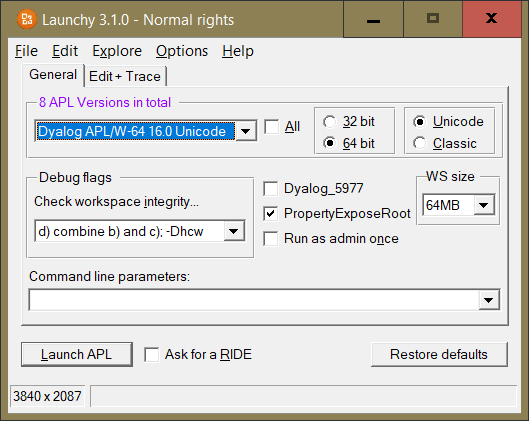
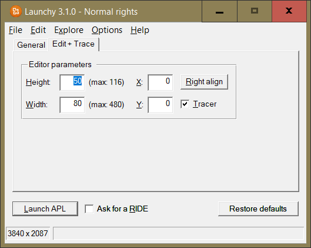
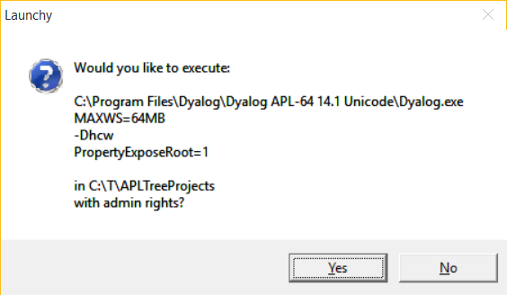
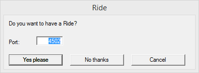

# Launchy

## Overview

**_Launchy_** is useful for people with several versions of Dyalog installed on their machine(s). If your are like me then you have about 12 versions of Dyalog installed, and you need different versions for different projects / clients. Launchy simplifies the process of firing up an instance of Dyalog as well as making adjustments to the size of edit windows or passing parameters via the command line.

Launchy offers two tabs with settings that can be adjusted independently from each other for each version of Dyalog installed on your machine. This is the first (main) Tab:

This is the second Tab:

Note that if you change any settings they will change color in order to allows you to spot any non-default settings with a glance.

There is one exception: the color of the "Run with admin rights" check box will change as soon as it is ticked.

In case the "Show command before launch" option is active Launchy shows the command just before it is going to be executed:

The "Ride" option is only visible when at least 14.0 is selected, and it is active only when the INI file does say so.

Ticking the box makes Launchy ask whether you would like to give the instance a Ride:

## Preconditions

Launchy is self-contained and does not rely on anything. It is a "bound executable", meaning that it can run even on a machine with no Dyalog installed at all, although this would not make too much sense of course.

## Documentation

* Have a look at the "launchy_manual.html" file which provides details. This file will be shown in your default browser by pressing F1 in Launchy or by selecting "Help" from its menu.

* Pay attention to the INI file which should be self-explanatory for programmers.